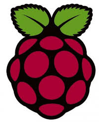

# {{site.course}}, {{site.year}} 

<h2>Course Information</h2>
<ul>

<li><a href="{{item.url}}"  data-ajax="false">{{item.title }}</a></li>

</ul>

<h2 id="labs">Lectures</h2>
  
  
  
  
  
  
  
  
  
  
  

<h2 id="labs">Labs</h2>


<h2 id="labs">Quiz</h2>


<h2 id="labs">Exams</h2>


<h2 id="labs">Topics</h2>
 <ul>
 
   <li><a href="{{item.url}}">{{item.topic}}&mdash;{{item.desc}}</a></li>
 
 </ul>

Copyright (c) 2016, Diba Mirza and Phill Conrad 

----

